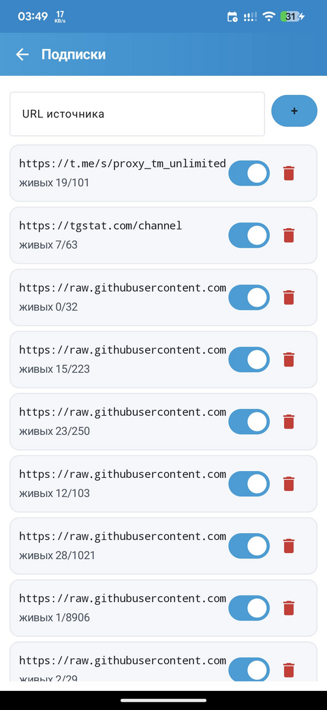
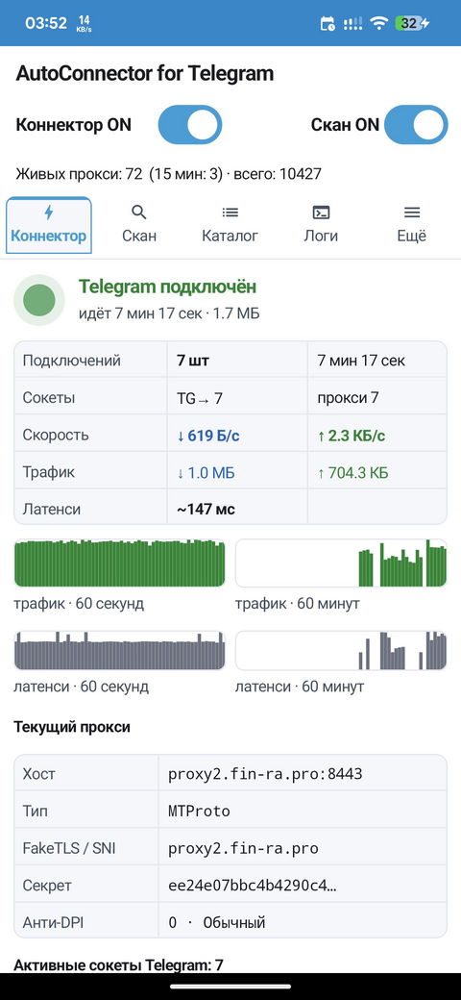

**Russian** | >>>> [ENGLISH HERE](README.en.md) <<<<

# AutoConnector for Telegram

**AutoConnector for Telegram** —  авто-коннектор: приложение
само находит в интернете MTProto-прокси, проверяет их на живость и поднимает
локальный релей, через который Telegram стабильно работает даже там, где он
заблокирован. Пользователю не нужно вручную искать рабочие прокси — AutoConnector
for Telegram постоянно подбирает самые быстрые и живые.

Другими словами: это сканер тг-каналов и всевозможных подписок с публичными бесплатными проксями MTProto, с автоподстановкой в ваш Телеграм. Обновлять клиент Телеграма не нужно. Доступность проксей проверяет именно с вашего устройства и сетевого окружения. Работает на WiFi+LTE без VPN.

## При первом запуске важно:

- провести настройку Телеграма, указав фиксированный SOCKS5 прокси от AutoConnector localhost:55001 и localhost:55002
- не блокировать уведомления, иначе в фоне работать не будет
- при первом запуске ждать ~15 минут, пока скачает и переберет MTProto прокси и пока сам Телеграм клиент переключится

## 📥 Скачать

Все сборки — на странице релизов: **[GitHub Releases (latest)](https://github.com/cheburnetik/AutoConnector_for_Telegram/releases/latest)**

| ОС | Файл | Запуск |
|----|------|--------|
| **Android** | `AutoConnector_for_Telegram.apk` | установить APK (вне Google Play — разрешите установку из источника) |
| **Windows** 10/11 x64 | `AutoConnector.for.Telegram.exe` | двойной клик (SmartScreen → «Подробнее» → «Выполнить») |
| **Linux** x64 | `AutoConnector-for-Telegram-linux-x64.tar.gz` | распаковать → `./AutoConnector-for-Telegram/AutoConnector.sh` |


## ✨ Возможности

- **Авто-поиск прокси** — сканирует десятки открытых страниц и подписок.
- **Проверка на живость** — реальный MTProto-handshake, рейтинг по скорости/стабильности.
- **Локальный релей** — Telegram подключается к `127.0.0.1`, а AutoConnector for
  Telegram маршрутизирует трафик через лучший живой прокси и переключается,
  если текущий упал.
- **Анти-DPI** — набор хитростей маскировки (имитация браузеров, дробление
  пакетов, FakeTLS и др.); режим «Авто-перебор» сам подбирает рабочий.
- **Подробная статистика** — живые/мёртвые прокси, скорость, латенси, трафик,
  эффективность каждой анти-DPI хитрости.
- **Каталог прокси** — топ по рейтингу с детальной карточкой по каждому хосту.

## 📸 Скриншоты

<table>
<tr>
<td align="center"><br><sub>Коннектор — Telegram подключён</sub></td>
<td align="center"><br><sub>Скан и статистика</sub></td>
<td align="center"><br><sub>Каталог прокси</sub></td>
<td align="center"><br><sub>Логи релея</sub></td>
</tr>
<tr>
<td align="center"><br><sub>Настройки</sub></td>
<td align="center"><br><sub>Подписки (источники)</sub></td>
<td align="center"><br><sub>Экспорт tg://-ссылок</sub></td>
<td align="center"><br><sub>Коннектор — активная сессия</sub></td>
</tr>
</table>


## Обратная связь

Баги и замечания скидывайте сюда - https://t.me/AutoConnector_for_Telegram

## 🔐 Проверка подписи

APK из релизов подписан release-ключом. Проверить можно так:

```bash
# Контрольная сумма (сравните с SHA256SUMS.txt из релиза)
sha256sum AutoConnector_for_Telegram.apk

# Цифровая подпись и отпечаток сертификата
apksigner verify --print-certs AutoConnector_for_Telegram.apk
```

Отпечаток сертификата (SHA-256), которым подписаны официальные сборки,
публикуется в описании каждого релиза — сверьте его, чтобы убедиться, что APK
не подменён.

## 📄 Лицензия

[MIT](LICENSE).
