[ENGLISH](README.en.md) · [ARABIC](README.ar.md) · [BENGALI](README.bn.md) · [BURMESE](README.my.md) · [CHINESE](README.zh.md) · [FRENCH](README.fr.md) · [GERMAN](README.de.md) · [HINDI](README.hi.md) · [INDONESIAN](README.id.md) · [ITALIAN](README.it.md) · [JAPANESE](README.ja.md) · [KOREAN](README.ko.md) · [MARATHI](README.mr.md) · [PERSIAN](README.fa.md) · [POLISH](README.pl.md) · [PORTUGUESE](README.pt.md) · [PUNJABI](README.pa.md) · [RUSSIAN](README.md) · [SPANISH](README.es.md) · [TAMIL](README.ta.md) · [TELUGU](README.te.md) · [THAI](README.th.md) · [TURKISH](README.tr.md) · [UKRAINIAN](README.uk.md) · [URDU](README.ur.md) · [VIETNAMESE](README.vi.md)

**[Download (latest)](https://github.com/cheburnetik/AutoConnector_for_Telegram/releases/latest)**

# AutoConnector for Telegram

AutoConnector for Telegram — हे अ‍ॅप स्वतः इंटरनेटवर MTProto-प्रॉक्सी शोधते, त्या जिवंत आहेत का ते तपासते आणि एक स्थानिक रिले उभे करते, ज्याद्वारे Telegram जिथे ब्लॉक केलेले आहे तिथेही स्थिरपणे काम करते. वापरकर्त्याला कार्यरत प्रॉक्सी स्वतः शोधण्याची गरज नाही — AutoConnector for Telegram सतत सर्वात वेगवान आणि जिवंत प्रॉक्सी निवडते आणि त्या नेमक्या तुमच्या संगणक/फोनवरूनच तपासते.

दुसऱ्या शब्दांत: हा MTProto सार्वजनिक मोफत प्रॉक्सी असलेल्या टेलिग्राम-चॅनेल आणि विविध सबस्क्रिप्शनचा स्कॅनर आहे, जो त्या आपोआप तुमच्या Telegram मध्ये भरतो. Telegram क्लायंट अपडेट करण्याची गरज नाही. प्रॉक्सीची उपलब्धता नेमकी तुमच्या डिव्हाइस आणि नेटवर्क वातावरणातून तपासली जाते. VPN शिवाय WiFi+LTE वर काम करते.

प्लॅटफॉर्म: Android, Windows, Linux, MacBook.

Android आवृत्ती स्वतःहूनच काम करते, परंतु Windows मध्ये "स्प्लिट..." किंवा "कोॲलेसिंग.." हे प्रॉक्सीकरण इंजिन सेट करावे लागते — सेटिंग्जमध्ये किंवा "Telegram जोडले आहे" या शब्दांच्या आणि मोठ्या राखाडी/हिरव्या वर्तुळाच्या उजव्या बाजूच्या बटणाने. किंवा तुमच्यासाठी जे चांगले चालेल ते निवडा, कारण ब्लॉकिंग सर्वत्र वेगवेगळी असते. "कोॲलेसिंग.." मोड्स अगदी शेवटचा उपाय म्हणून — असे केल्यास Telegram चालू होईल, पण चॅटमधील मीडिया कंटेंटचे पाठवणे/दाखवणे बिघडेल.

जर तुम्ही COMODO सारखा फायरवॉल वापरत असाल तर तो बंद करण्याची शिफारस करतो: तो अ‍ॅपला सँडबॉक्समध्ये टाकतो आणि त्याचा फायरवॉल MTProto प्रॉक्सीकडे जाणारे आउटगोइंग कनेक्शन बिघडवतो. किंवा अ‍ॅप व्हर्च्युअल मशीनमध्ये चालवा, तिथे TCP स्टॅक पूर्णपणे बदलतो आणि AutoConnector चे वर्तन वेगळे असेल.

तसेच, कार्यरत प्रॉक्सीपर्यंत आणि Telegram च्या आत "Connected" या नोंदीपर्यंत लवकर पोहोचण्यासाठी, Telegram ला 55001 आणि 55002 पोर्टमध्ये (प्रॉक्सी सेटिंग्जमध्ये) हाताने स्विच करायला मदत करा.

# ✨ वैशिष्ट्ये

- **प्रॉक्सीचा स्वयं-शोध** — डझनभर खुली पृष्ठे आणि सबस्क्रिप्शन स्कॅन करते.
- **जिवंतपणाची तपासणी** — खराखुरा MTProto-handshake, वेग/स्थिरतेनुसार रेटिंग.
- **स्थानिक रिले** — Telegram `127.0.0.1` ला जोडते, आणि AutoConnector for
  Telegram ट्रॅफिक सर्वोत्तम जिवंत प्रॉक्सीद्वारे मार्गस्थ करते आणि सध्याचा
  पडल्यास स्विच करते.
- **अँटी-DPI** — मास्किंगच्या युक्त्यांचा संच (ब्राउझरचे अनुकरण, पॅकेट तुकडे
  करणे, FakeTLS इत्यादी); «स्वयं-शोधन» मोड स्वतःच कार्यरत युक्ती निवडतो.
- **तपशीलवार आकडेवारी** — जिवंत/मृत प्रॉक्सी, वेग, latency, ट्रॅफिक, प्रत्येक
  अँटी-DPI युक्तीची परिणामकारकता.
- **प्रॉक्सी कॅटलॉग** — रेटिंगनुसार टॉप, प्रत्येक होस्टसाठी तपशीलवार कार्डसह:
  प्रत्येक होस्टसाठी «Telegram कनेक्शन / यशस्वी / एकूण तपासण्या» आणि शेवटच्या
  25 प्रयत्नांचा इतिहास (TCP/TLS/एकूण कनेक्शन कालावधी, स्वीकारलेले/पाठवलेले बाइट्स) दिसतो.
- **होस्टची लवचिक निवड** — «रुंदी» स्लायडर: «सर्वोत्तम तपासलेल्यांना धरून राहणे»
  पासून «शक्य तितक्या व्यापकपणे विविध जिवंत प्रॉक्सी आजमावणे» पर्यंत; जेव्हा
  Telegram रिले पोर्टमध्ये फिरत राहते तेव्हा निवड आपोआप विस्तारते. वेगळा
  स्लायडर — कनेक्शन टाइमआउट (100 ms … 15 s) आणि «अपस्ट्रीमची शर्यत» (समांतर अनेक कनेक्शन).
- **12 भाषा** इंटरफेसच्या, स्वयं-ओळखीसह, RTL-समर्थन.

> ### 1.0.19 च्या तुलनेत नवीन काय आहे
> - **नेटवर्क प्रकारानुसार होस्टच्या वेगळ्या डेटाबेस आणि रेटिंग** — VPN / Wi-Fi / LTE /
>   Ethernet / White: प्रत्येक प्रकारचे कनेक्शन जिवंत प्रॉक्सीचा स्वतःचा पूल ठेवते,
>   जेणेकरून फक्त VPN खालीच चालणारे काहीतरी Telegram ला दिले जाऊ नये.
> - **अपस्ट्रीमची शर्यत** — समांतर अनेक कनेक्शन, सर्वात वेगवान जिवंत जिंकते;
>   «निवडीची रुंदी» स्लायडर (सर्वोत्तम तपासलेल्यांपासून शक्य तितक्या व्यापकापर्यंत)
>   पूलच्या स्वयं-विस्तारासह, जेव्हा Telegram रिले पोर्टमध्ये फिरते;
>   समायोज्य कनेक्शन टाइमआउट (100 ms…15 s).
> - **तपशीलवार कार्डसह होस्ट कॅटलॉग** — «Telegram कनेक्शन / यशस्वी /
>   एकूण तपासण्या» आणि होस्टनुसार शेवटच्या 25 प्रयत्नांचा इतिहास (TCP/TLS वेळ,
>   कनेक्शन कालावधी, स्वीकारलेले/पाठवलेले बाइट्स).
> - **जिवंत आलेख** वेग, पिंग आणि पोर्ट क्रियाशीलतेचे (सेकंद आणि मिनिटांनुसार)
>   तसेच स्कॅनिंगचे आलेख.
> - **अँटी-DPI आणि प्रॉक्सीकरण इंजिने** — «स्वयं-शोधन» सह मास्किंग युक्त्यांचा संच,
>   obfuscation इंजिन आणि विशिष्ट ब्लॉकिंगसाठी प्रायोगिक इंजिने (स्प्लिट/
>   कोॲलेसिंग).
> - **निर्यात/आयात** सेटिंग्ज, होस्ट आणि सबस्क्रिप्शनचे + फॅक्टरी स्थितीत पूर्ण रीसेट.
> - **जलद कोल्ड स्टार्ट** — अनेक anonymizers द्वारे सबस्क्रिप्शनचे आक्रमक बहु-थ्रेडेड लोडिंग.
> - **26 भाषा** इंटरफेसच्या, स्वयं-ओळखीसह (+RTL).

# पहिल्यांदा चालू करताना महत्त्वाचे:

- Telegram ची सेटिंग करा, निश्चित SOCKS5 प्रॉक्सी localhost:55001 आणि localhost:55002 दर्शवून.
- या व्यतिरिक्तचे इतर प्रॉक्सी काढून टाका.
- Telegram मध्ये "Use proxy" चालू करा.
- Android वर सूचना ब्लॉक करू नका, अन्यथा ते पार्श्वभूमीत काम करणार नाही.
- पहिल्यांदा चालू करताना MTProto प्रॉक्सी डाउनलोड व निवडले जाईपर्यंत आणि Telegram क्लायंट स्वतः स्विच होईपर्यंत ~15 मिनिटे वाट पाहा.

# जर काहीच काम करत नसेल

1. जर काहीच काम करत नसेल, तर प्रोग्राम जिवंत प्रॉक्सींचे स्वयं-कॅटलॉग म्हणून वापरा. CTRL+WIN+ALT+P आणि CTRL+SHIFT+ALT+P हॉटकीने तुम्ही AutoConnector ची विंडो न उघडता पटकन एक यादृच्छिक प्रॉक्सी थेट तुमच्या Telegram मध्ये जोडू शकता. असे होईल की Telegram थेट प्रॉक्सीकडे जाईल, AutoConnector शिवाय, पण तुम्हाला मोफत प्रॉक्सी प्रकाशित करणारे चॅट तपासत बसण्याची आणि त्यांच्या तपासणीवर वेळ घालवण्याची गरज राहणार नाही. AutoConnector ट्रे मध्ये राहू द्या, "Connector" टॉगल बंद करा, "Scan" टॉगल चालू ठेवा.

2. AutoConnector दुसऱ्या डिव्हाइसवर आजमावा: फोन, मित्राचा फोन, संगणक. Windows/Android या वेगवेगळ्या प्लॅटफॉर्मवर ब्लॉकिंग टाळण्याचे तत्त्व पूर्णपणे वेगळे आहे. बहुधा Android वर कोणत्याही सेटिंगशिवाय काम करेल.

3. जर काहीच काम करत नसेल, तर एका दिवसासाठी तात्पुरते VPN चालू करा आणि त्या दिवशी AutoConnector + Telegram तपासा (Telegram ला AutoConnector द्वारे जोडा, 55001 आणि 55002 पोर्टवरील प्रॉक्सी दर्शवून). प्रोग्रामच्या आत "When VPN is on -> proxy to MTProto" हा चेकबॉक्स चालू करा. पाहा, AutoConnector काम करू लागले का? जर होय, तर निष्कर्ष स्पष्ट आहे — AutoConnector यशस्वीपणे प्रॉक्सी शोधते, Telegram चा ट्रॅफिक यशस्वीपणे तिथे रिले करते, पण जर VPN बंद केला, तर तुमच्या देशातील ब्लॉकिंग सिस्टीम सर्व आउटगोइंग कनेक्शन फारच कठोरपणे ब्लॉक करते. अशा परिस्थितीत तुम्हाला AutoConnector मधील साधने आजमावण्यात अर्धा तास घालवावा लागेल, जेणेकरून ब्लॉकिंग टाळू शकणारे कार्यरत साधन निवडता येईल. सर्व पर्याय आपोआप पूर्णपणे आजमावणे प्रोग्रामला अजून जमत नाही (फक्त anti-DPI युक्त्यांचा स्वयं-शोध आहे). प्रयोगानंतर VPN बंद करा आणि "When VPN is on, proxy to MTProto" हा चेकबॉक्स "Proxy directly" स्थितीत परत आणा.

4. मुद्दा (3) ला पर्याय. तुमच्या Windows/Linux होस्टवर एक व्हर्च्युअल मशीन सेट करा. त्यात Telegram + AutoConnector चालवा. VPN शिवायही उत्तम काम करू लागले का? म्हणजे तुमचा होस्ट तुमचे कनेक्शन बिघडवतो, तुमच्या देशातील ब्लॉकिंग सिस्टीम नव्हे! कारणे: फायरवॉल, अँटीव्हायरस, VPN चे अवशेष. जर अँटीव्हायरस AutoConnector ला सँडबॉक्समध्ये टाकत असेल, किंवा फायरवॉल AutoConnector च्या असामान्य anti-DPI युक्त्या ब्लॉक करत असेल, तर तुम्हाला होस्टवर AutoConnector ला अँटीव्हायरस आणि फायरवॉलच्या बायपास (अपवाद) मध्ये चालू करावे लागेल. किंवा संगणक रीस्टार्ट करून त्यांना काही काळासाठी पूर्णपणे बंद करा. होय, सल्ला देणे कितीही हास्यास्पद वाटले तरी, संगणक रीस्टार्ट करा, कारण VPN प्रोग्राम अनेकदा गडबडतात आणि होस्टवर TUN उपकरण अर्धमृत स्थितीत सोडू शकतात. रीस्टार्टनंतर VPN चालू करू नका, आधी AutoConnector तपासा.

  5. ब्लॉकिंग टाळणे आजमावा. चालू करण्याचे बटण सेटिंग्जमध्ये किंवा मुख्य स्क्रीनवर शोधा (राखाडी/हिरव्या रंगाच्या मोठ्या वर्तुळाच्या उजव्या बाजूचे बटण शोधा). तुम्हाला ~15 मिनिटे द्यावी लागतील. ती 3 गटांची आहेत:
	  - प्रॉक्सीकरण इंजिन. कोणताही कोॲलेसिंग* मोड आजमावा. बहुधा लगेच चालू होईल. पण त्यावेळी Telegram मध्ये चित्रे/व्हिडिओ लोड होणार नाहीत (हा बग नसून फीचर/तडजोड आहे). पुढे स्प्लिट* मोड आजमावा, चालू झाल्यास — चित्रे लोड होतात. किंवा "disabled" वर परत आणा.
	  - "Parallel upstream race" आजमावा. याचा अर्थ जेव्हा Telegram प्रॉक्सीकडे 1 कनेक्शन करते, तेव्हा AutoConnector वेगवेगळ्या MTProto प्रॉक्सींकडे 5-30 कनेक्शन करते आणि Telegram ला सर्वोत्तम देते. अ‍ॅपच्या सेटिंग्जमध्ये टाइमआउट (3-5 सेकंद) आणि समांतर अपस्ट्रीमची संख्या 30 पर्यंत निवडता येते.
	  - "Auto-cycle anti-DPI tricks" चालू करा, प्रोग्राम त्या स्वतः आजमावत राहील.
	  - Telegram ने अधिक लवकर स्विच व्हावे म्हणून, प्रॉक्सी सेटिंग्जमध्ये (Telegram मध्ये) हाताने दर 5-10 सेकंदांनी पुढच्या पोर्टवर वर्तुळाकारात स्विच करा 55001->55002->55001->...

6. सर्वात शक्तिशाली/जलद सेटिंग्जचे संयोजन:
	- कनेक्शन टाइमआउट 5s
	- होस्ट निवडीची रुंदी 100%
	- समांतर कनेक्शन 30
	- DPI युक्त्यांचा स्वयं-शोध
	- समांतर अपस्ट्रीमची शर्यत
	- प्रॉक्सीकरण इंजिन: कोॲलेसिंग*
	- Telegram च्या आत प्रॉक्सी विंडोमध्ये दर 10 सेकंदांनी नवीन पोर्टवर वर्तुळाकारात टॅप करा.

7. Windows आणि Android वरील सेटिंगचे धोरण वेगळे आहे! वर लिहिलेले सर्व मुख्यतः Windows बद्दल आहे. Android वर बहुतेकांसाठी कोणत्याही सेटिंगशिवाय काम करते (कोणत्याही सेटिंगवर). Windows मध्ये वेगळा TCP स्टॅक आणि वेगळे Telegram अ‍ॅप आहे, ते Android पेक्षा गुणवत्तेत खूपच वाईट आहे. फक्त अधिकृत नाही तर दुसरा एखादा Telegram क्लायंट आजमावा.

8. कृपया कोणत्याही भाषेत तपशीलवार बगरिपोर्ट https://t.me/AutoConnector_for_Telegram येथे लिहा — प्लॅटफॉर्म, कोणत्या पद्धती आजमावल्या (सेटिंग्ज), तुमच्याकडे फायरवॉल/अँटीव्हायरस आहे का, VPN/व्हर्च्युअल मशीनमधून आजमावले का. कोणत्याही सकारात्मक रेसिपीही लिहा, काय आजमावले आणि ते कसे चालू झाले.


## 📥 डाउनलोड

सर्व बिल्ड्स — रिलीज पृष्ठावर: **[GitHub Releases (latest)](https://github.com/cheburnetik/AutoConnector_for_Telegram/releases/latest)**

| OS | फाइल | चालवणे |
|----|------|--------|
| **Android** | `AutoConnector_for_Telegram.apk` | APK इन्स्टॉल करा (Google Play च्या बाहेर — स्रोतावरून इन्स्टॉलला परवानगी द्या) |
| **Windows** 10/11 x64 | `AutoConnector-for-Telegram-windows-x64.zip` | अनझिप करा → `AutoConnector\AutoConnector.exe` चालवा |
| **Linux** x64 | `AutoConnector-for-Telegram-linux-x64.tar.gz` | अनझिप करा → `./AutoConnector/bin/AutoConnector` |
| **macOS** 11+ (Apple Silicon) | `AutoConnector-for-Telegram-macos.tar.gz` | अनझिप करा → `AutoConnector.app` वर डबल-क्लिक करा (ब्लॉक होत असल्यास — `xattr -dr com.apple.quarantine AutoConnector.app`) |

### 🔐 सत्यता पडताळणी (release 1.1.0)

APK release-प्रमाणपत्राने स्वाक्षरीत आहे (apksigner, schemes v1+v2+v3). इन्स्टॉल करण्यापूर्वी तुम्ही तपासू शकता:

- **स्वाक्षरी प्रमाणपत्र (SHA-256):** `cb23a18c0cf8a23e43b5b63d199fc1440d3e4d6533e1309d3f92f273fe626a5a`
  (CN=AutoConnector for Telegram) — हा फिंगरप्रिंट सर्व भविष्यातील रिलीजसाठी सारखाच आहे.
- **APK SHA-256:** `d7652e7f5c3a2174a3b7805c2539df7da080765c9b0f581a7ac5943987c9b935`
- **Windows zip SHA-256:** `1d8d675936387e89038dc4943d7f99200c1b735b86e1f79bd953cd93e60f0217`
- **Linux tar.gz SHA-256:** `9160ea519309dc62750a4a930dc1aae6e20dbcefd21b426fa85b48ace6f3e8f8`
- **macOS tar.gz SHA-256:** `322082ef3f06955ed299be790bce453e47db37fca17daea54724d60698446bc7`

पडताळणी: `apksigner verify --print-certs AutoConnector_for_Telegram.apk` (प्रमाणपत्र) आणि
`sha256sum -c SHA256SUMS.txt` (फाइलची अखंडता; `SHA256SUMS.txt` रिलीजसोबत जोडलेले आहे).

## 📸 स्क्रीनशॉट्स

<table>
<tr>
<td align="center">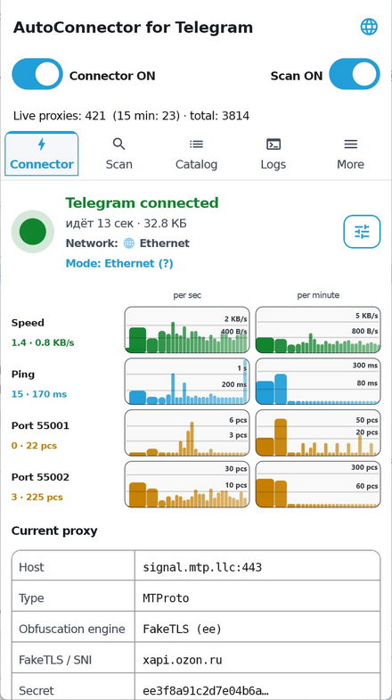<br><sub>कनेक्टर — सक्रिय सत्र</sub></td>
<td align="center">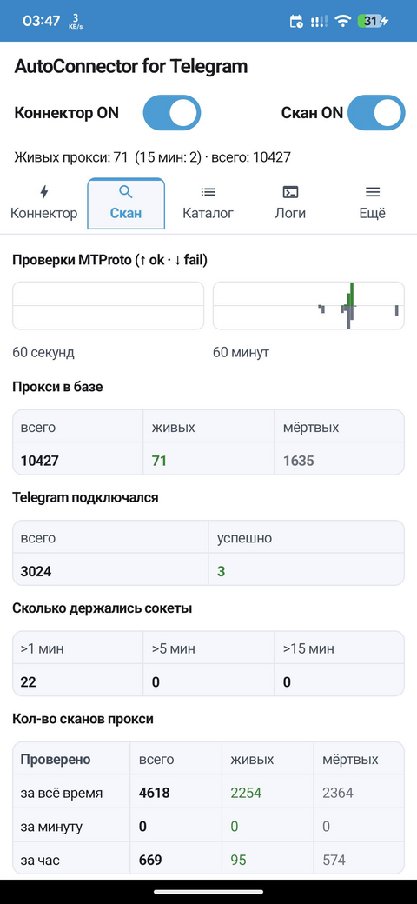<br><sub>स्कॅन आणि आलेख</sub></td>
<td align="center">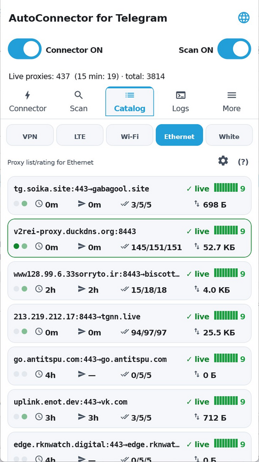<br><sub>प्रॉक्सी कॅटलॉग (मोडनुसार)</sub></td>
<td align="center">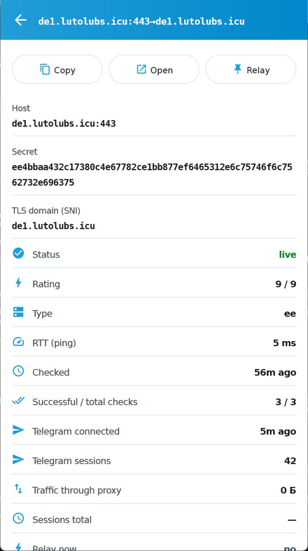<br><sub>होस्ट कार्ड + इतिहास</sub></td>
</tr>
<tr>
<td align="center">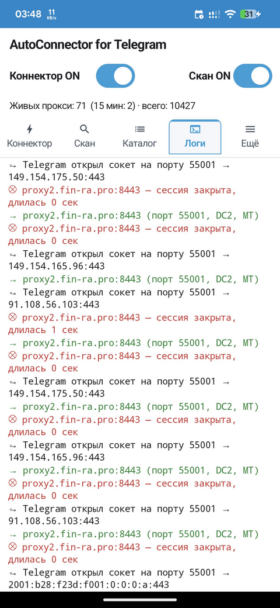<br><sub>रिले लॉग्स</sub></td>
<td align="center">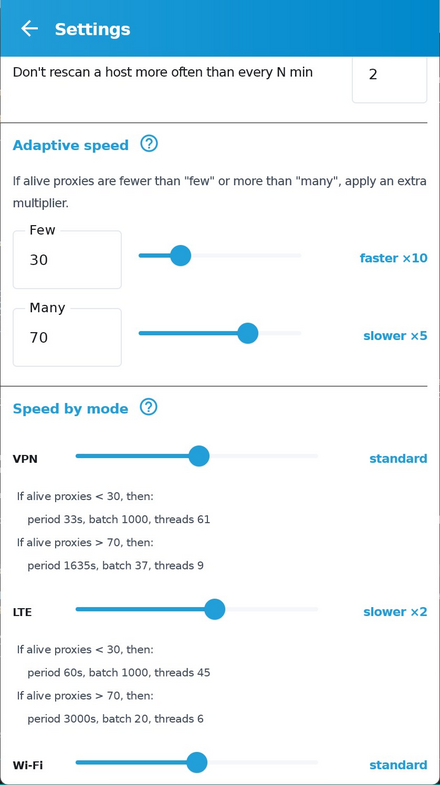<br><sub>सेटिंग्ज</sub></td>
<td align="center">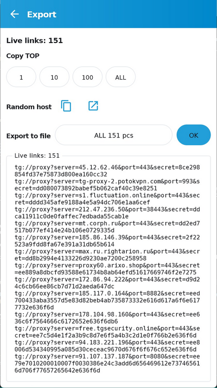<br><sub>tg://-लिंक्सचे निर्यात</sub></td>
<td align="center">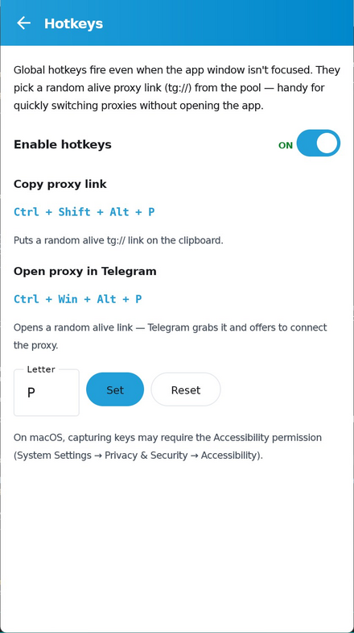<br><sub>हॉटकीज</sub></td>
</tr>
<tr>
<td align="center">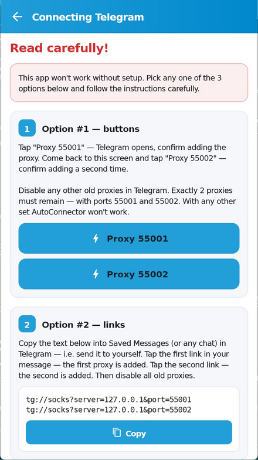<br><sub>कनेक्शन मार्गदर्शक</sub></td>
<td align="center">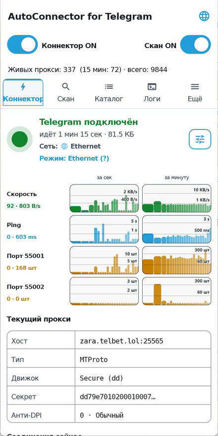<br><sub>कनेक्टर · रशियन UI</sub></td>
<td align="center">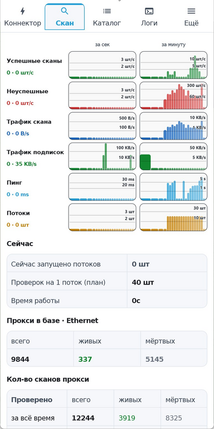<br><sub>स्कॅन · रशियन UI</sub></td>
<td align="center"><sub>26 इंटरफेस भाषा<br>स्वयं-ओळखीसह</sub></td>
</tr>
</table>


## अभिप्राय

बग आणि टिप्पण्या इथे पाठवा - https://t.me/AutoConnector_for_Telegram

## 🔐 स्वाक्षरी पडताळणी

रिलीजमधील APK release-कीने स्वाक्षरीत आहे. असे तपासता येते:

```bash
# चेकसम (रिलीजमधील SHA256SUMS.txt शी तुलना करा)
sha256sum AutoConnector_for_Telegram.apk

# डिजिटल स्वाक्षरी आणि प्रमाणपत्राचा फिंगरप्रिंट
apksigner verify --print-certs AutoConnector_for_Telegram.apk
```

अधिकृत बिल्ड्स ज्या प्रमाणपत्राच्या फिंगरप्रिंटने (SHA-256) स्वाक्षरीत आहेत, तो
प्रत्येक रिलीजच्या वर्णनात प्रकाशित केला जातो — APK बदलला गेला नाही याची खात्री
करण्यासाठी त्याची पडताळणी करा.

## 📄 परवाना

[MIT](LICENSE).
